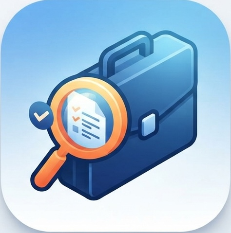

# Job Hunt Tracker

<p align="center">
  
</p>

A desktop app for tracking job applications, follow-ups, and progress across the hiring process.

## Features

- Track job applications with company, role, location, link, and date
- Save contact details and notes for each application
- Monitor status across stages such as applied, interview, follow-up, and rejected
- View dashboard summaries and analytics
- Keep local SQLite data for each user
- Runs as a native desktop app on macOS

## Tech Stack

- Rust
- eframe / egui for the desktop UI
- rusqlite with bundled SQLite database support
- chrono for date handling
- open for opening links in the default browser

## Requirements

- Rust stable toolchain (current stable recommended)
- Cargo
- Git
- A desktop OS: macOS, Linux, or Windows

### Platform-specific prerequisites

#### macOS

- Xcode Command Line Tools
- Optional: cargo-bundle for generating .app and .dmg bundles

#### Linux

- Build tools such as gcc / make / pkg-config
- Libraries required by native GUI dependencies
- Often: `libxcb`, `libxkbcommon`, and related X11/Wayland packages if your distro requires them

#### Windows

- MSVC Build Tools or Rust's MSVC toolchain
- Git Bash, PowerShell, or Command Prompt

## Install Rust

### macOS / Linux

```bash
curl --proto '=https' --tlsv1.2 -sSf https://sh.rustup.rs | sh
source "$HOME/.cargo/env"
```

### Windows

Download and install Rust via rustup:

```powershell
https://rustup.rs/
```

Then verify:

```bash
rustc --version
cargo --version
```

## Clone the project

```bash
git clone <your-repo-url>
cd job_hunt_tracker
```

## Run on macOS

```bash
cargo run
```

Release build:

```bash
cargo build --release
./target/release/job_hunt_tracker
```

Bundle into a macOS app:

```bash
cargo install cargo-bundle
cargo bundle --release
```

Output:

```bash
target/release/bundle/osx/
target/release/bundle/dmg/
```

## Run on Linux

```bash
cargo run
```

Release build:

```bash
cargo build --release
./target/release/job_hunt_tracker
```

If the app fails to start because of missing native libraries, install the required GUI dependencies for your distro, for example:

```bash
sudo apt update
sudo apt install build-essential pkg-config libx11-dev libxkbcommon-dev libwayland-client0 libwayland-cursor0 libwayland-egl1-mesa
```

## Run on Windows

From PowerShell or Command Prompt:

```powershell
cargo run
```

Release build:

```powershell
cargo build --release
.\target\release\job_hunt_tracker.exe
```

If you want a Windows installer, use a packaging tool compatible with your setup, or distribute the built `.exe` directly.

## Project structure

```text
job_hunt_tracker/
├── Cargo.toml
├── README.md
├── icons/
│   └── icon.png
├── src/
│   └── main.rs
└── target/
```

## Database

The app stores data in a local SQLite database at:

```bash
~/Library/Application Support/JobHuntTracker/jobs.db
```

The database is created automatically when the app starts if it does not already exist.

## Notes

- The app icon is configured in Cargo bundle metadata and also set at runtime for the native window.
- The app uses a local SQLite database rather than a server, so no external database service is required.

## License

This project is currently provided as-is for personal or local use.
